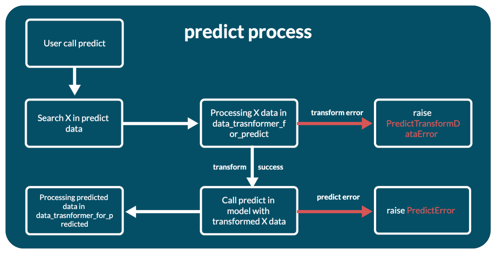
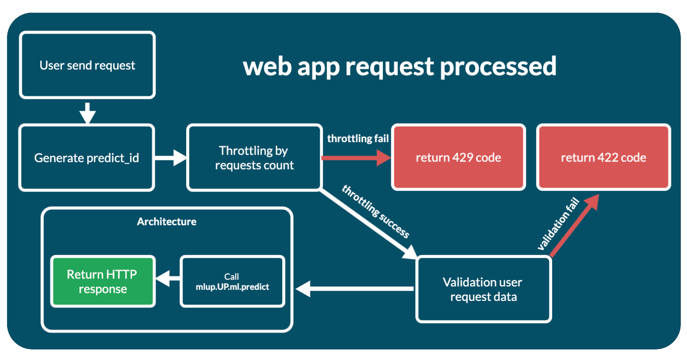

# Life cycle

The entire life process of an mlup application can be divided into two stages - application initialization and running application.

## Initializing the application

mlup consists of two main components - [ml](https://github.com/nxexox/pymlup/tree/main/mlup/ml) and [web](https://github.com/nxexox/pymlup/tree/main/mlup/web).

### mlup.ml

This component contains all the code for working with your model, including all settings associated with the model.

When you create a `mlup.UP` object and pass a model `mlup.UP(ml_model=your_model)` into it, mlup does nothing.
At this point, you have simply created a class. This is done in order to avoid starting the processes of loading and analyzing the model, which can be lengthy, without explicit instructions.


#### up.ml.load()

To start using your model, you need to load the model into mlup - `up.ml.load()`.
At this point, mlup first loads your model into memory. In the case of `mlup.UP(ml_model=your_model)` your model is already loaded and mlup will not load it into memory again.

Loading a model into memory consists of two stages:
* Loading binary data using `storage_type`;
* Deserilization of binary data into the model;

If you use `storage_type=mlup.constants.StorageType.disk`, by default binary data is not loaded into memory and binarizers themselves load the model during binarization.
This was done to eliminate the possibility of duplicating model data in memory. Binaryizers have access to a local disk, so it is not difficult for them to load the model themselves.
To change this behavior, `storage_type=mlup.constants.StorageType.disk` has a `need_load_file` flag, which defaults to False.

The storage concept is needed to load binary model data from different storages to a local disk, from where binarizers will read the data.

Once the model is loaded in memory, `up.ml.load_model_settings()` is called inside `up.ml.load()`.

You can check whether the model has been loaded into memory using the `up.ml.loaded: bool` property. It becomes True only when the model is in memory. 
But it does not indicate whether the model was analyzed using the `up.ml.load_model_settings()` method.

#### up.ml.load_model_settings()

The `up.ml.load_model_settings()` method analyzes the loaded model, according to the settings specified in the config, and prepares the `mlup.UP` object to work with it.

At this point the analysis occurs:
* Method for prediction;
* Method arguments for prediction;
* Creating data transformers to convert user data into model format and model response into user format;
* Creation of auxiliary entities, such as `concurrent.futures.ThreadPoolExecutor`;

After this, your model is ready to be used via mlup.

If you change some setting related to the operation of the model, just call `up.load_model_settings()`.
Then mlup will not reload your model into memory, but will simply analyze it again taking into account the changed config.

```python
import numpy
import mlup

class MyModel:
    def predict(self, X):
        return X

model = MyModel()

up = mlup.UP(ml_model=model, conf=mlup.Config(auto_detect_predict_params=True))
up.ml.load()

obj_1 = [1, 2, 3]
obj_2 = [4, 5, 6]
objs_for_predict = [obj_1, obj_2]
up.predict_from(X=numpy.array(objs_for_predict))

up.conf.auto_detect_predict_params = False
# Refresh mlup model settings
up.ml.load_model_settings()

up.predict_from(data_for_predict=numpy.array(objs_for_predict))
```

### mlup.web

To launch a web application, it also needs to be initialized with `up.web.load()`.

When using `up.run_web_app()`, you don't need to worry about this - mlup will initialize it itself.
But if the web component has already been initialized, you need to specify the `up.run_web_app(force_load=True)` parameter.
If you want to launch your web application in any of the other ways, you need to take care of initializing it yourself - call the `up.web.load()` method.

_P.S. You don't have to worry if you forget to call `up.web.load()`. mlup will not be able to launch the web application and will crash with the error [WebAppLoadError](https://github.com/nxexox/pymlup/blob/main/mlup/errors.py)_

Unlike the ml component, the web component has only 1 loading method, `up.web.load()`, which each time recreates the web app application and reinitializes all settings.

Loading a web application consists of several sequential stages (all of them are hidden inside `up.web.load()`):
* `up.web.load_web_app_settings()` - preloading parameters for initializing and launching the application. Here transformations and filling of internal structures take place for the configuration of the web application and the backend of the application.
* `up.web._create_app()` - initialization of the web application itself and its backend, construction of the API and application documentation. This is where the analysis results from your machine learning model are most used.
* `self._architecture_obj.load()` - initialization of the web application architecture. Some architectures require some operations before launch: initializing workers and queues, adding custom API methods to a web application, and other operations. (See [Web app architectures](web_app_architectures.md)).

Almost always, you need to call `up.web.load()` and not worry about its internals. But understanding the initialization order will help you write your own modules correctly and customize the application.

Because the web component builds the API and validation for incoming data, it uses the results of your model analysis.
This means that you will not be able to initialize web first and then ml. The web component needs an initialized ml component to initialize.

Just like in the case of ml, web has the `up.web.loaded` attribute. It becomes True if and only if a `fastapi.FastAPI` application is created. 
Those only after calling `up.web.load()`.

If your application has already called `up.web.load()`, and then you change the settings, this attribute will still be True. 
You need to independently monitor the reinitialization of the application after updating the config.

```python
import mlup

class MyModel:
    def predict(self, X):
        return X

model = MyModel()

up = mlup.UP(ml_model=model)
up.ml.load()

obj_1 = [1, 2, 3]
obj_2 = [4, 5, 6]
objs_for_predict = [obj_1, obj_2]
model_predicted = model.predict(X=objs_for_predict)
mlup_predicted = up.predict(X=objs_for_predict)

print(f'Before call up.web.load: {up.web.loaded}')
up.web.load()
print(f'After call up.web.load and before change config: {up.web.loaded}')
up.conf.port = 8011
print(f'After call up.web.load and after change config: {up.web.loaded}')
up.web.load()
print(f'After double call up.web.load: {up.web.loaded}')
up.run_web_app()

import requests
resp = requests.post('http://0.0.0.0:8011/predict', json={'X': objs_for_predict})
web_app_predicted = resp.json()

up.stop_web_app()

print(model_predicted)
print(mlup_predicted)
print(web_app_predicted)
```

After successful initialization of the web component, you can launch your application in a way convenient for you.

## Ml predict process

The `up.ml.predict` method calls the web application for prediction. But you also use it when you call any of the methods: `up.predict`, `up.predict_from`, `up.async_predict`.

Behind it lies a process of several stages:
* First of all, the main array with object attributes - X - is searched in the transmitted user data. To do this, the `up.ml.get_X_from_predict_data` method is called.
* If X is found, in other words the data is not empty, then the found data X is passed through the data transformer specified in the `data_transformer_for_predict` configuration parameter. Called `up.ml._transform_data_for_predict`. See [Data Transformers](data_transformers.md).
* If there are problems with the transformation, a [PredictTransformDataError](https://github.com/nxexox/pymlup/blob/main/mlup/errors.py) exception will be thrown. If the transformation is successful, the data is used for prediction.
* Prediction is the actual call to `predict` on the model with the transformed data. But depending on the configuration and the [(use_thread_loop) Description of the configuration file](config_file.md) parameter, the prediction is run with or without `concurrent.futures.ThreadPoolExecutor`.
* If the prediction caused an error, a [PredictError](https://github.com/nxexox/pymlup/blob/main/mlup/errors.py) exception will be thrown.
* And if the prediction is successful, the prediction results will be sent to the data transformer from the `data_transformer_for_predicted` configuration parameter for conversion to a valid JSON format and returned from the method. Called `up.ml._transform_predicted_data`.



## Web application work

After launching the web application, it is ready to accept requests from users. When a developer independently writes a web application with a model, he has full control and knowledge of how the request processing process occurs.
mlup takes care of this, so the entire request processing process is described here.



The process looks like this:
* A request has been received from a user.
* If this is not a /predict request, then it immediately goes to the handler. If `/predict`, wrappers for the handler are processed first:
  * `mlup.web.app._set_predict_id_to_response_headers` - generates _predict_id_ and sets the request headers to it. Thus, it can be used in the request handler itself and its subfunctions.
  * `mlup.web.app._requests_throttling` - throttling by the number of requests to the predictor. If the request is not throttled, the web application responds with a 429 response code. Enabling/disabling throttling and configuration can be found in [Description of the configuration file (throttling_max_requests)](https://github.com/nxexox/pymlup/blob/main/docs/config_file.md#webapp-work-settings).
* If not `/predict`, a JSON response is generated and returned to the client. Next we'll look at the `/predict` method.
* During web application initialization, a pydantic model is created to validate incoming data. The Pydantic model is based on the result of model analysis and mlup configuration and is available in the `up.web._predict_inner_pydantic_model` attribute.
Incoming data is run and validated through this pydantic model. If there are errors, the application immediately responds with a 422 response code with validation errors.
* If the validation is successful, validation occurs for the length of the request - the number of objects for predict in the request. If the request is not throttled, the web application responds with a 429 response code. Enabling/disabling and configuration of request length throttling can be found in [Description of the configuration file (throttling_max_request_len)](https://github.com/nxexox/pymlup/blob/main/docs/config_file.md#webapp-work-settings)
* After successfully passing through all stages of validation and throttling, the request is transferred to the architecture for processing, to the `up.web._architecture_obj.predict` method.
* After receiving a response from the architecture component, the web application responds with what the architecture component responded.

The processing code itself is short:
```python
@_set_predict_id_to_response_headers
@_requests_throttling
async def predict(self, request: FastAPIRequest, response: FastAPIResponse):
    predict_id = response.headers[PREDICT_ID_HEADER]
    # Validation
    try:
        predict_request_body = self._predict_inner_pydantic_model(**(await request.json()))
    except json.JSONDecodeError as e:
        raise PredictValidationInnerDataError(msg=f'Invalid json data: {e}', predict_id=predict_id)
    data_for_predict = predict_request_body.dict()

    # Throttling
    if self.conf.throttling_max_request_len:
        self._request_len_throttling(data_for_predict)

    # Predict in web app architecture object
    predict_result = await self._architecture_obj.predict(data_for_predict, predict_id=predict_id)

    # Result
    return {"predict_result": predict_result}
```

## Web application customization

If you need to add your own code to initialize the FastAPI application, it is available through the `up.web.app: fastapi.FastAPI` attribute.

The web application becomes available only after calling `up.web.load()`. In this method it's created.

```python
import mlup
from mlup.ml.empty import EmptyModel


up = mlup.UP(ml_model=EmptyModel(), conf=mlup.Config())
up.ml.load()
up.web.load()

app = up.web.app


def my_api_method():
    return {}


app.add_api_route("/my-api-method", my_api_method, methods=["GET"], name="my-api-method")
up.run_web_app()
```

