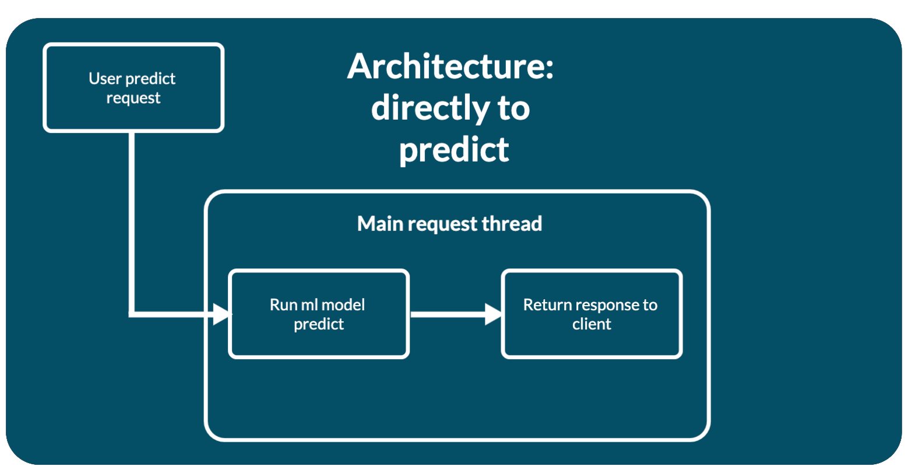
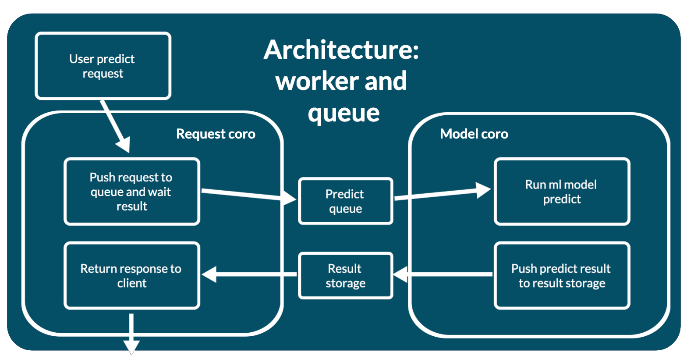
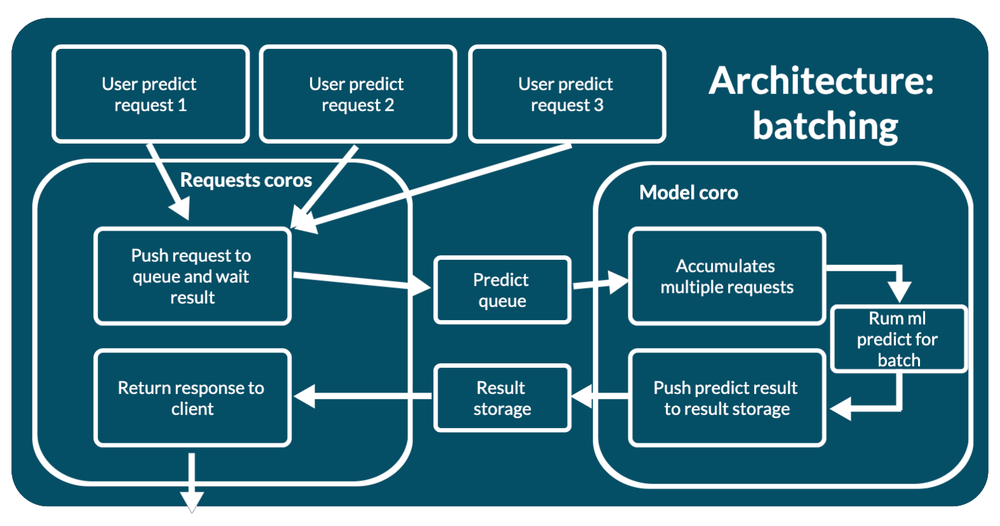

# Web app architectures

The mlup web application has several architectures:
* [mlup.web.architecture.directly_to_predict.DirectlyToPredictArchitecture](https://github.com/nxexox/pymlup/blob/main/mlup/web/architecture/directly_to_predict.py);
* [mlup.web.architecture.worker_and_queue.WorkerAndQueueArchitecture](https://github.com/nxexox/pymlup/blob/main/mlup/web/architecture/worker_and_queue.py);
* [mlup.web.architecture.batching.BatchingSingleProcessArchitecture](https://github.com/nxexox/pymlup/blob/main/mlup/web/architecture/batching.py);

You can change the architecture using the `mode` configuration parameter (See "[Description of the configuration file](config_file.md#web)").
`mlup.web.architecture.directly_to_predict.DirectlyToPredictArchitecture` is set in the default config.

As described in "[Description of the application life cycle](life_cycle.md)", loading a web application is only possible when `mlup.ml` has already been loaded into memory.

The architecture requires initialization just like a web application. This happens inside `mlup.UP.web.load()`, after the web application itself has been fully initialized.
In fact, the architecture must support an interface of several methods:
```python
from typing import Any, Dict
import mlup
from mlup.constants import WebAppArchitecture
from mlup.web.architecture.base import BaseWebAppArchitecture

class Architecture(BaseWebAppArchitecture):
    ml: mlup.MLupModel
    type: WebAppArchitecture
    
    def __init__(self, **configs):
        self.archi_conf_name = configs.pop('archi_conf_name')
        # ...
    
    def load(self):
        pass

    async def run(self):
        pass

    @property
    def is_running(self) -> bool:
        pass

    async def stop(self):
        pass

    async def predict(self, data_for_predict: Dict, predict_id: str) -> Any:
        pass
```

The constructor contains all configs from the web application configuration.

The `load` method is called when the architecture is initialized, the last step in initializing a web application.
This method creates everything necessary for the architecture to work - all internal structures and objects.

The `run` method is called when the application starts using the lifespan FastAPI mechanism (see [FastAPI lifespan docs](https://fastapi.tiangolo.com/advanced/events/)).
The `stop` method is called when the application is terminated using the FastAPI lifespan mechanism (see [FastAPI lifespan docs](https://fastapi.tiangolo.com/advanced/events/)).
```python
@asynccontextmanager
async def _lifespan(app: FastAPI):
    # Startup web app code
    await architecture.run()
    yield
    # Shutdown web app code
    await architecture.stop()
```

The `predict` method is called every time a new prediction request comes from the user.
The `data_for_predict` argument contains already validated data in the same format in which it was received in the web request.
The `predict_id` argument includes the unique generated id of the predict request. It can be used to uniquely identify the data included in the request.

The `predict` method itself calls `mlup.UP.ml.predict` at the right time.

## mlup.web.architecture.directly_to_predict.DirectlyToPredictArchitecture

This is a simple web application architecture - a direct call to model prediction.

When several parallel requests arrive, each of them, independently of each other, will call `web.UP.ml.predict`.
This can lead to various problems:
* Using more resources.
* Slowdown of prediction and web application.
* Locks if the model cannot simultaneously work in parallel.

This architecture is well suited for fast models that can process multiple requests per second.



### Initialization of the architecture

This architecture does not require any initialization.

### Request Lifecycle

The request is processed immediately and directly - `mlup.UP.ml.predict` is called.
```python
async def predict(self, data_for_predict: Dict, predict_id: str) -> Any:
    return await self.ml.predict(**data_for_predict)
```

## mlup.web.architecture.worker_and_queue.WorkerAndQueueArchitecture

This architecture involves running the machine learning model in a separate thread, thereby not blocking the main thread of the web application.

Predictions are asynchronous:
* WEB: Place the request in the prediction request queue.
* WORKER: The model rakes up this queue and runs a predictor on the data from the queue one by one.
* WORKER: The model puts the prediction results into the result store.
* WEB: The query waits for its result by `predict_id` to appear in the result store.

This approach allows you to control concurrent user access to the model resource.
The model will always process only 1 request while the others are in the queue.

To configure queue sizes and response prediction lifetimes, there are configuration parameters:
* `max_queue_size: int` - maximum queue size for prediction requests.
* `ttl_predicted_data: int` - maximum lifetime of the prediction result in seconds.
  If the client does not wait for the prediction results, its prediction is no longer needed and should be removed from the results store.
  This setting controls how long after the results are deleted if the client has not collected them.
  The countdown starts from the moment the result is saved in the results storage.
* `is_long_predict: bool` - enable an additional API method in which you can retrieve the prediction result.
  When the prediction takes a long time or the client wants to retrieve the prediction results later, he can do this in a separate API method.
  This parameter adds an API method `GET: /get-predict/{predict_id}`, in which you can get prediction results if they are in the results store.
  See "[Web app API](web_app_api.md)".
* `ttl_client_wait: float` - the maximum time to wait for client results in the `GET: /get-predict/{predict_id}` method in seconds.
  See "[Web app API](web_app_api.md)".



### Initialization of the architecture

For the architecture to work, you need:
* Queue for prediction requests.
* Storage of prediction results with TTL.
* Thread for model work.

All this is created at the time of initialization. Since mlup works in an asynchronous paradigm, the model prediction worker is launched as `asyncio.Task`.
This allows you not to block the web application during model prediction, within one process.

### Request Lifecycle

The processing of the request with all the nuances is described here.
Request path:
* A validated request is included in the architecture.
* The architecture places the request data in a prediction queue.
* When a request waits its turn, the worker extracts the `predict_id` from it and sends the user data to the model.
* The request is digested by the model and it makes a prediction. The worker combines the prediction results with the previously extracted `predict_id` and stores them in the results storage.
* If an error occurs during prediction, then the worker will store this error in the results store under the same conditions as the results and with the same TTL.
* The client retrieves the prediction result from the result store. This could be the result of a prediction or an error.

The architecture has a method `_get_result_from_storage`, which time `ttl_client_wait` tries to find the prediction result in the storage by `predict_id`.
If an error occurs during prediction, the worker will store this error in the results store instead of the prediction result.
And when the `_get_result_from_storage` method reads the results and sees an error, it will return an error to the client with the appropriate response code.

If `is_long_predict=False`, then the architecture, after adding a request to the prediction queue, immediately calls this method and waits exactly `ttl_client_wait` for the results.
If during `ttl_client_wait` the prediction results have not appeared in the storage, the web application responds to the client with a 408 response code and will not be able to get any more results.
The result will be removed from the storage after adding it there via `ttl_predicted_data`.

If `is_long_predict=True`, then the architecture immediately responds with JSON `{"predict_id": "your_predict_id"}` after adding a request to the prediction queue.
After which, the client, at a convenient time, can make a request to `GET: /get-predict/{predict_id}` for the results.
The handler for this request simply calls `_get_result_from_storage` and returns what this method returned.
```python
async def get_predict_result(predict_id: str):
    return await _get_result_from_storage(predict_id)
```
The client can make as many requests to `GET: /get-predict/{predict_id}`.
But prediction results or prediction error can only be obtained once for one `predict_id`.
Once received by the client, the results will be deleted from the results storage.

## mlup.web.architecture.batching.BatchingSingleProcessArchitecture

This architecture is very similar to `mlup.web.architecture.worker_and_queue.WorkerAndQueueArchitecture`.
But `mlup.web.architecture.worker_and_queue.WorkerAndQueueArchitecture` sends 1 request for prediction sequentially.
While `mlup.web.architecture.batching.BatchingSingleProcessArchitecture` combines several requests into one batch and sends this batch for prediction.

This architecture is very convenient to use when your model spends approximately the same time predicting one and several objects.
For example, it takes ~1 second to predict 1 object, and ~1.1 second to predict many objects.

This architecture involves running the machine learning model in a separate thread, thereby not blocking the main thread of the web application.
* WEB: Place the request in the prediction request queue.
* WORKER: The model clears this queue, combines several requests into one batch and runs a predictor for the batch.
* WORKER: The model puts the batch prediction results into the results store.
* WEB: The query waits for its result by `predict_id` to appear in the result store.

This approach allows you to control concurrent user access to the model resource.
At the same time, the model can simultaneously process several requests at once.

The batch has two restrictions:
* `min_batch_len: int` - the minimum batch size that is needed to start prediction. The worker will run a prediction on the model of the current batch if this batch exceeds the size specified in this parameter.
* `batch_worker_timeout: float` - maximum time for creating a batch. The worker will start a prediction for the current batch model if the batch generation time has reached this value. Even if the batch size has not reached `min_batch_len`.

Batching reads `batch_worker_timeout` time requests from the prediction request queue.
If, after adding the next request to the batch, the batch size exceeds `min_batch_len`, the worker will send the batch for prediction.
If during the `batch_worker_timeout` time the batch has not reached a size exceeding `min_batch_len`, the worker sends it for prediction in the form in which it is.

The `batch_worker_timeout` timeout starts after the first request is added to the batch.
After each batch prediction, the batch is reset and re-assembled. Accordingly, the `batch_worker_timeout` time is reset to zero.

We can only regulate the minimum batch size, and cannot regulate the maximum batch size.
Since in one request more than one object for prediction can come, but several, a worker can read 1 request from the queue and receive several objects for prediction at once.
Therefore, you cannot adjust the batch size from above - ~~max_batch_len~~. It is possible to read from the prediction request queue more objects to predict than ~~max_batch_len~~.
For example, ~~max_batch_len~~=10`, and two requests came with 9 and 3 objects. Then the worker, having read the first request from the queue, will not get it for the batch. It will read the second request and the batch will be larger than it should be.
Therefore, it will not be able to send data for prediction.

In addition to the `batch_worker_timeout` and `min_batch_len` batching parameters, there are configuration parameters for configuring the batching architecture:
* `max_queue_size: int` - maximum queue size for prediction requests.
* `ttl_predicted_data: int` - maximum lifetime of the prediction result in seconds. 
  If the client does not wait for the prediction results, its prediction is no longer needed and should be removed from the results store.
  This setting controls how long after the results are deleted if the client has not collected them.
  The countdown starts from the moment the result is saved in the results storage.
* `is_long_predict: bool` - enable an additional API method in which you can retrieve the prediction result.
  When the prediction takes a long time or the client wants to retrieve the prediction results later, he can do this in a separate API method.
  This parameter adds an API method `GET: /get-predict/{predict_id}`, in which you can get prediction results if they are in the results store.
  See "[Web app API](web_app_api.md)".
* `ttl_client_wait: float` - the maximum time to wait for client results in the `GET: /get-predict/{predict_id}` method in seconds.
  See "[Web app API](web_app_api.md)".



### Initialization of the architecture

For this architecture to work, you need:
* Queue for prediction requests.
* Storage of prediction results with TTL.
* Thread for model work.

All this is created at the time of initialization. Since mlup works in an asynchronous paradigm, the model prediction worker is launched as `asyncio.Task`.
This allows you not to block the web application during model prediction, within one process.

### Request Lifecycle

The processing of the request with all the nuances is described here.
Request path:
* A validated request is included in the architecture.
* The architecture places the request data in a prediction queue.
* When a request waits its turn, the worker takes the `predict_id` from it and adds the user data to the batch.
* The batch is formed as a Python List, where new requests from the queue are added to the end of the list.
* When a batch is formed by size or collection time, it is sent to the model for prediction.
* The request is digested by the model and it makes a prediction. **It is important that the data transformers and the model itself give prediction results for objects in the same order in which the data entered the model. 
  In most cases, models behave this way.**
  The worker divides the prediction results by `predict_id` and stores them in the results storage.
* If an error occurs during prediction, then the worker will store this error in the results store under the same conditions as the results and with the same TTL.
* The client retrieves the prediction result from the result store. This could be the result of a prediction or an error.

Let's take 3 queries: 2, 4, 1 objects in each, respectively `[[1, 2], [3, 4, 5, 6], [7]]`. A batch of size 7 is assembled from them in the order in which the requests came and the objects in them are `[1, 2, 3, 4, 5, 6, 7]`.
When the model made its predictions, it returned the same array of 7 responses: `["ans1", "ans2", "ans3", "ans4", "ans5", "ans6", "ans7"]`.
Batching will dissolve the response array into as many arrays as were involved in the request batch - 3 `[["ans1", "ans2"], ["ans3", "ans4", "ans5", "ans6"], ["ans7"]]`.

The architecture has a method `_get_result_from_storage`, which time `ttl_client_wait` tries to find the prediction result in the storage by `predict_id`.
If an error occurs during prediction, the worker will store this error in the results store instead of the prediction result.
And when the `_get_result_from_storage` method reads the results and sees an error, it will return an error to the client with the appropriate response code.
Since multiple queries are involved in the prediction at the same time, an error will be returned for each of these queries.

If `is_long_predict=False`, then the architecture, after adding a request to the prediction queue, immediately calls this method and waits exactly `ttl_client_wait` for the results.
If during `ttl_client_wait` the prediction results have not appeared in the storage, the web application responds to the client with a 408 response code and will not be able to get any more results.
The result will be removed from the storage after adding it there via `ttl_predicted_data`.

If `is_long_predict=True`, then the architecture immediately responds with JSON `{"predict_id": "your_predict_id"}` after adding a request to the prediction queue.
After which, the client, at a convenient time, can make a request to `GET: /get-predict/{predict_id}` for the results.
The handler for this request simply calls `_get_result_from_storage` and returns what this method returned.
```python
async def get_predict_result(predict_id: str):
    return await _get_result_from_storage(predict_id)
```
The client can make as many requests to `GET: /get-predict/{predict_id}`.
But prediction results or prediction error can only be obtained once for one `predict_id`.
Once received by the client, the results will be deleted from the result storage.

## Custom architecture

If the capabilities of mlup web architectures are not enough for you, you can write your own web architecture.

The web architecture interface is:
```python
# my_module.py
from typing import Any, Dict
import mlup
from mlup.constants import WebAppArchitecture
from mlup.web.architecture.base import BaseWebAppArchitecture

class Architecture(BaseWebAppArchitecture):
    ml: mlup.MLupModel
    type: WebAppArchitecture
    
    def __init__(self, **configs):
        self.archi_conf_name = configs.pop('archi_conf_name')
        # ...
    
    def load(self):
        pass

    async def run(self):
        pass

    @property
    def is_running(self) -> bool:
        pass

    async def stop(self):
        pass

    async def predict(self, data_for_predict: Dict, predict_id: str) -> Any:
        pass
```

And specify the path to import your module in `mode`: `my_module.Architecture`.

**IMPORTANT: a web architecture written independently must be available for import on the server on which you run the mlup application.**

The easiest way to do this is to create your own python library with your web architecture and other useful classes and install it on your server along with the pymlup library.
